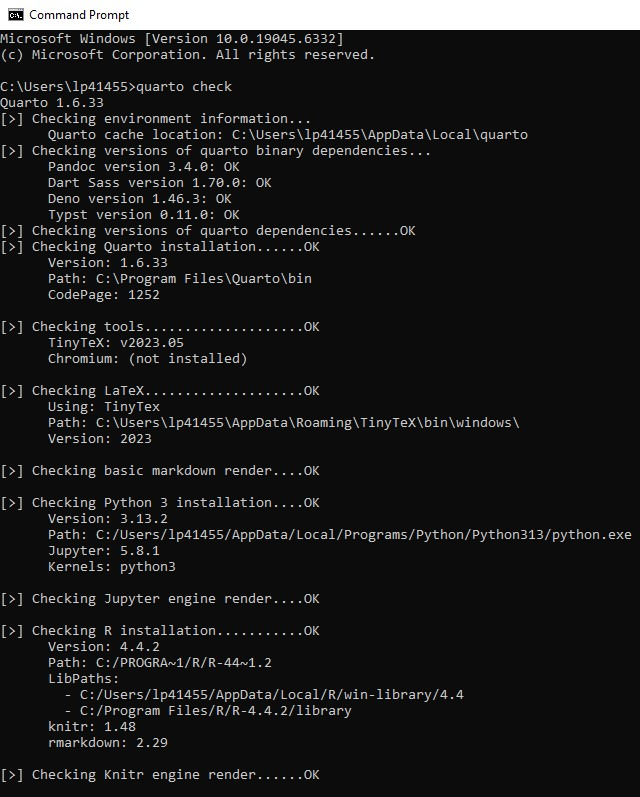
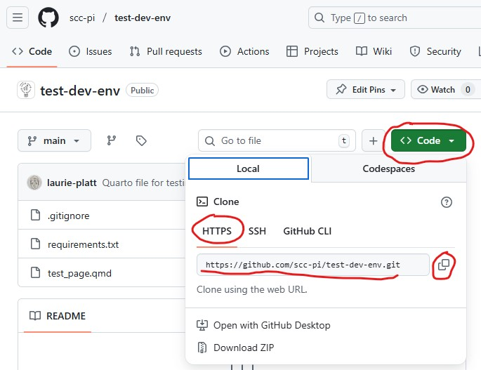
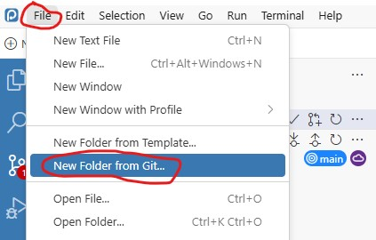
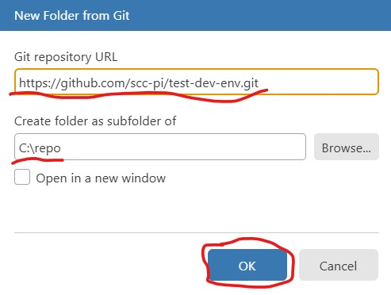
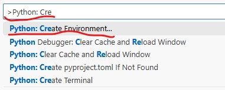
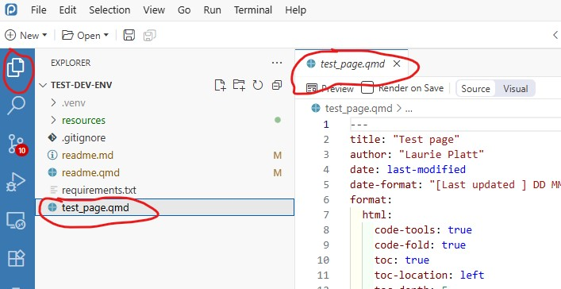
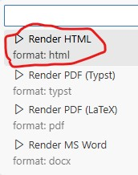
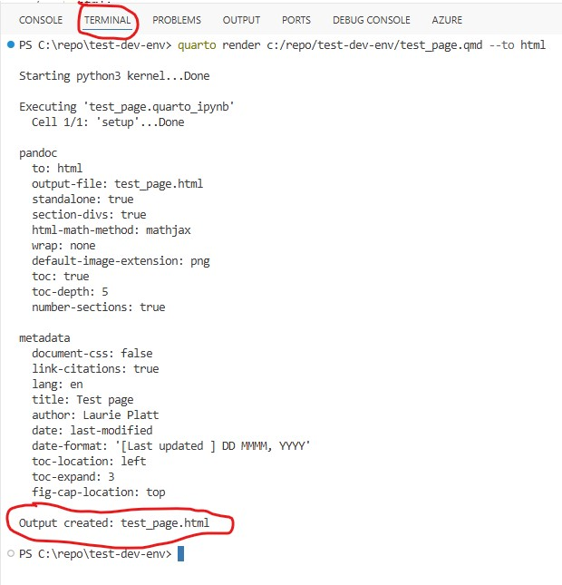

# Test Development Environment

# Introduction

The purpose of this repo is to help with testing of development
environments e.g. using Python for data analysis.

# Git

> To test whether Git is installed, open a terminal, type
> `git --version` and press enter.

**Resource:**  
[Setting up Git (NHS Service
Manual)](https://prototype-kit.service-manual.nhs.uk/how-tos/git)

# Python

> To test whether Python is installed, open a terminal, type `py -0` and
> press enter.

# Quarto

Quarto is as part of the Positron install.

> To test the Quarto installation, open a terminal, type `quarto check`
> and press enter.

# Clone repo

Testing:

- Positron  
- Git

> Copy the HTTPS web URL for the
> [github.com/scc-pi/test-dev-env](https://github.com/scc-pi/test-dev-env)
> repo.

https://github.com/scc-pi/test-dev-env.git

> Open Positron.

> Create a new folder from Git (*File* \> *New Folder from Git…*):

> Paste the web URL for the repo:

> In the Explorer pane you should see a few files from the repo:

# Create virtual environment

Testing:

- Positron  
- Python  
- Venv  
- Python package installation

> To create a new virtual environment, from the Command Palette
> (*Ctrl* + *Shift* + *P*) start typing “Python: Create Environment” and
> select *Python: Create Environment…*:

> Select *venv* as the environment type:

> Select a Python interpreter:

> Select the dependencies (Python packages) to install by checking
> `requirements.txt` file tick box:

> Wait while the environment is created:

> Once it’s done you should get a notification and you should also see
> that *venv* is mentioned in the current interpreter selection:

# Render Quarto document

Testing:

- Positron  
- Python  
- Python packages  
- Quarto

> Open `test-page.qmd`:

> From the Command Palette select *Quarto: Render Document*:

> Select *Render HTML*:

> The terminal pane will detail progress:

> The Positron default is for the HTML output to be shown in a preview
> pane. Alternatively, you can check the output by opening the
> `test_page.html` in your browser.

# Appendix

## Update readme

The `readme.md` file is generated via `readme.qmd`.
